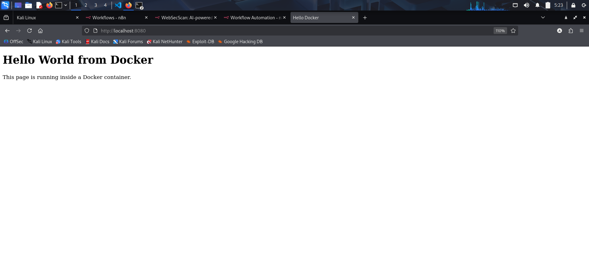
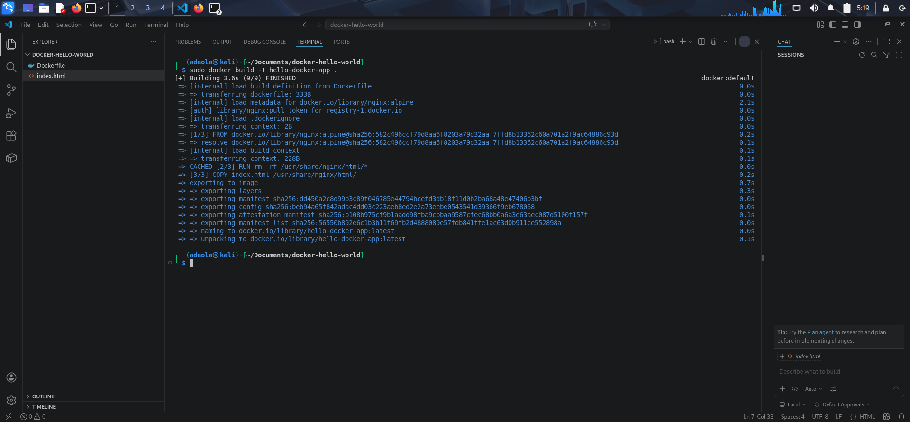
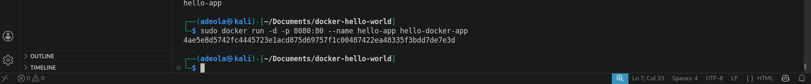

# Containerize an Application

## Student Task
Create a small app or static site (display hello world or a form that receives input and displays an output)
- Write a Dockerfile using:
    - FROM
    - RUN
    - CMD
- Build the image locally

- Run the container

## Deliverables
- Source code or static files

- Dockerfile
- Screenshot of docker build

- Screenshot of docker run

- Short explanation of what each Dockerfile instruction does

    - FROM : FROM defines the base image for our Docker image. In this case, we are using the official nginx image based on Alpine Linux, which is a minimal and efficient base image.

    - RUN : Executes commands during image build
    
    - CMD : CMD specifies the command to run when the container starts. Here, we are starting nginx in the foreground to keep the container running.

